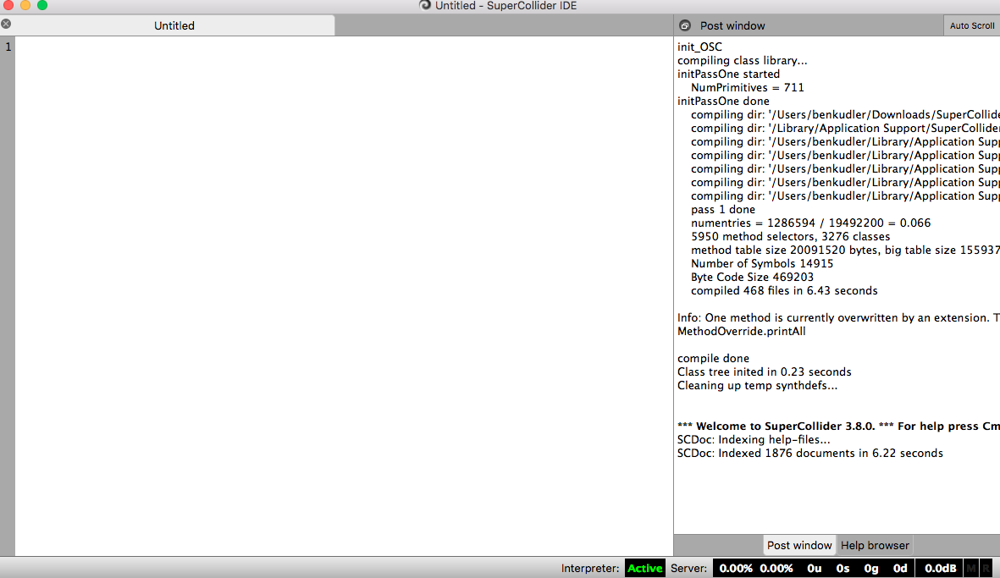
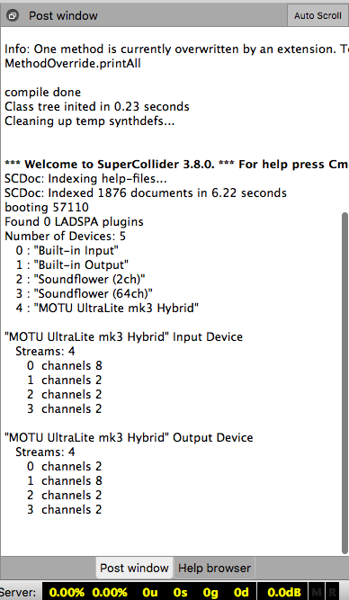
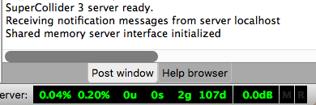
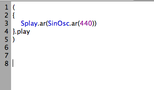
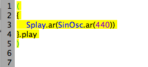

#Pre-Practice

The following will walk you through, step by step, starting up SuperCollider and making some basic sounds. Don't worry about understanding everything that is happening, or, even, most of what is happening just try to have fun and experiment and trust that understanding will grow over time

The first thing you will need to do is open SuperCollider, open it up! Once the program is open it will look something like this:

SuperCollider is actually made up of three different things

* A server
  * Something that takes in code and spits out cool sounds
* A programming language
  * To write code that the server can understand and use to spit out cool sounds
* A text editor
  * So you can write code with a little formatting assitance as well as look at the help files while you code.

You are going to need to start the server if you want to make any sounds so let's do that!
`cmd b` - this is for macs.

If you are using a windows machine, things will be a little different. I suggest looking [here](http://danielnouri.org/docs/SuperColliderHelp/Tutorials/Tutorial.html)

The server should look like this while it's booting

and once it is loaded

notice how the small server bar at the bottom went from white to yellow to green, once it's green it means we are good to go.

Okay, so now we are ready to make some sound. My own experience, and the experience, and some research, of many others shows that copying and pasting code doesn't help us much in learning stuff, but typing it out grants access to all sorts of subtleties we wouldn't normally notice. 

Copy every character from this image
*it's an image so you can't copy and paste!*

don't really worry much about what is going on, but if you would really like to know, you are piping a sin wave with a frequency off 440 hz to a mixer that spreads the signal out across the stereo field. Basically you have a really full sound that you hear in both speakers equally.

###LET'S MAKE IT DO SOMETHING!

In order to have some code execute we have to highlight the code and question and then hit `cmd enter`

How do we know what we need to highlight, though!?!

SuperCollider helps us with that. Put your cursor right before the first parentheses and it will show you what is in the given code block

Go ahead and highlight everything in yellow, it should look like this

and hit `cmd enter`

ahhhhh!!! a crazy sound that's kind of nice, but kind of shrill, how do I make it stop?!?!?

simply hit `cmd .`

Try changing the '440' to different numbers, what happens?

Well, that's a lot of fun, but we can't exactly change on the fly and every-time we want to stop we have to do this weird `cmd .` thing...

okay, let's go a little further

copy this code, it will help you learn!

Once you have it written out highlight the highlighted segment, remember, to get the code block, just place your cursor before the first parentheses.

I also show where you should highlight.

Try executing the next line, as shown here.

What happens?? Try changing the number and executing multiple times.

When you want to stop execute the last line

Experiment! go back and forth between the two different code chunks, make music and try to do it live with as little silence as possible, can you do it? Can you create multiple versions of each? Look at how much you are doing already! Good work!!!!